# Profile README Snippet

Paste this snippet into your special GitHub profile repository (`<username>/<username>/README.md`):

```html
<div align="center">

<!-- Terminal Profile Header -->
<h3><code><username>@github ~ $ whoami</code></h3>

<table>
  <tr>
    <td valign="top"></td>
    <td valign="top"></td>
  </tr>
</table>

<br>
<br>

<!-- Animated GitHub Contributions Heatmap -->
<h3><code><username>@github ~ $ ./contributions.sh</code></h3>



<br>
<br>

<sub>Built with <a href="https://github.com/Aiyzoxx/animated-terminal-profile">animated-terminal-profile</a> · Inspired by <a href="https://github.com/AVIVASHISHTA29">Avi Vashishta</a></sub>

</div>
```
